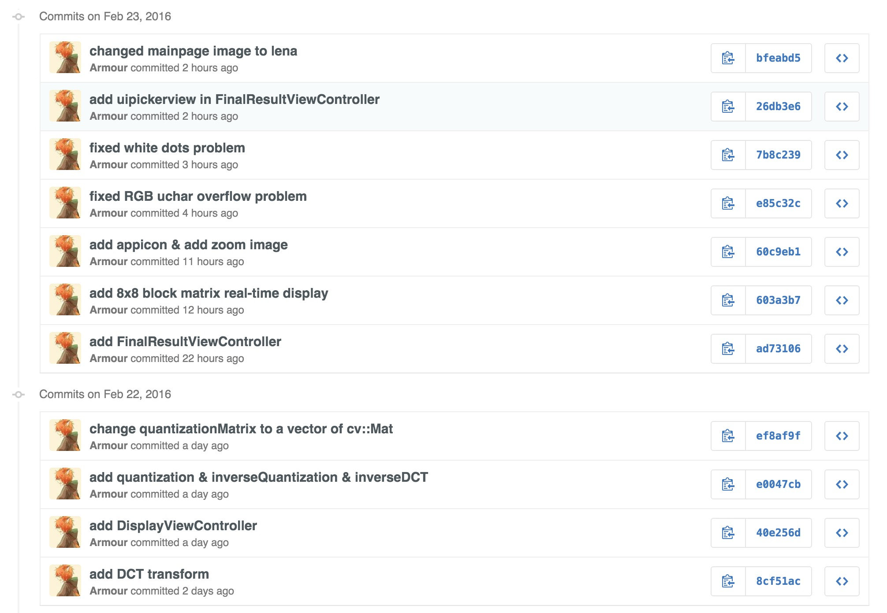
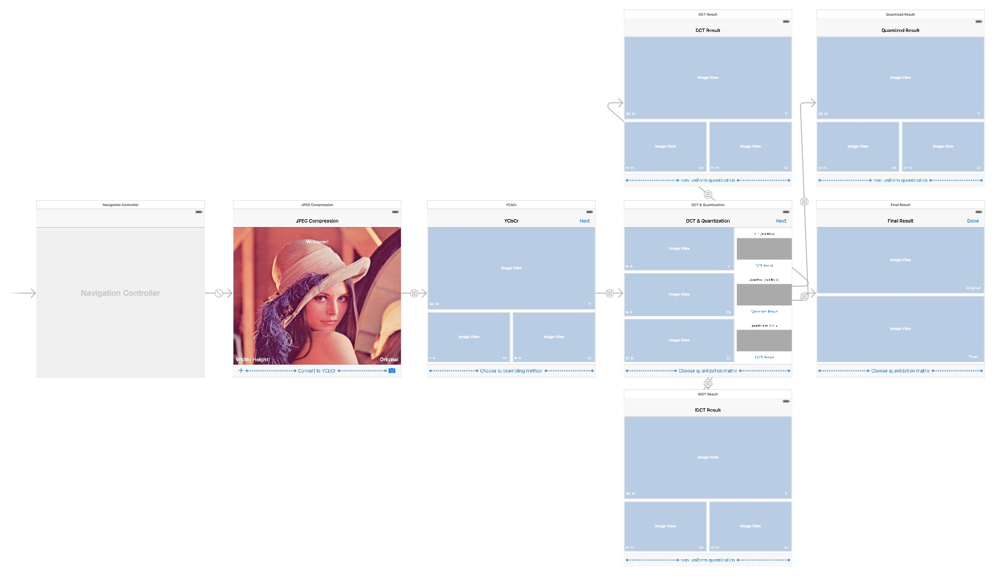
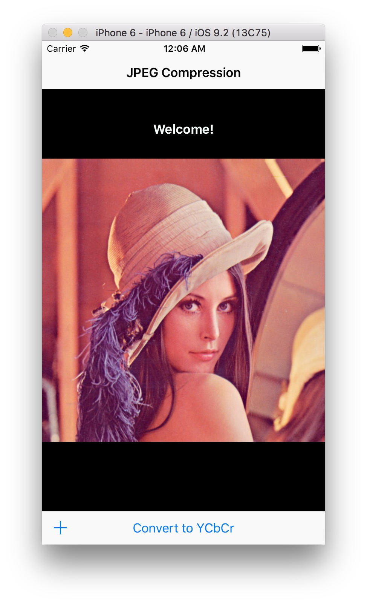
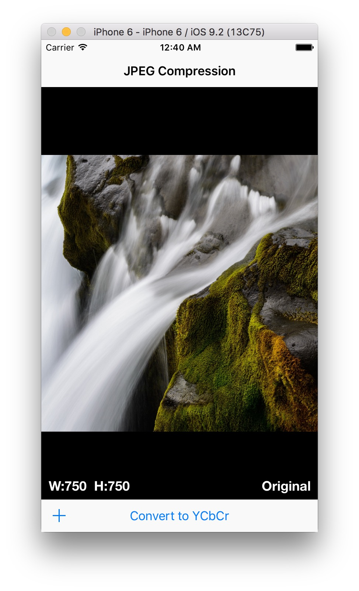
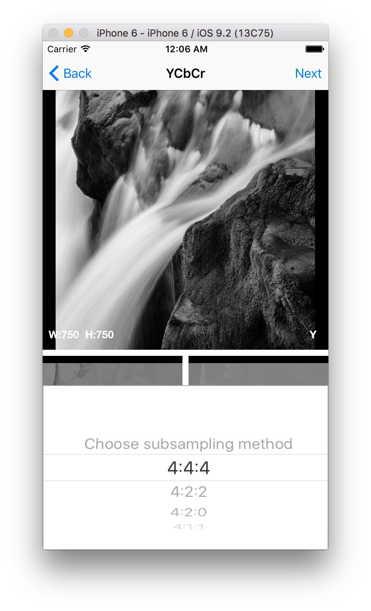
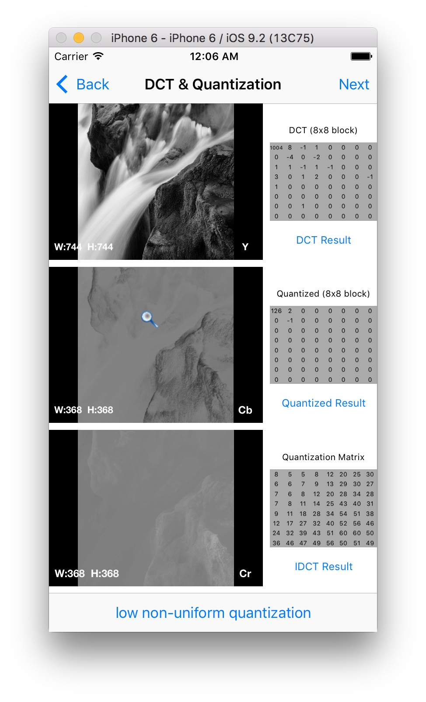
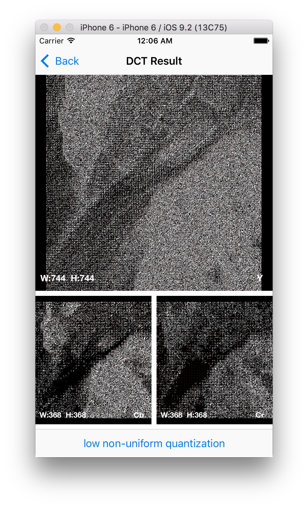
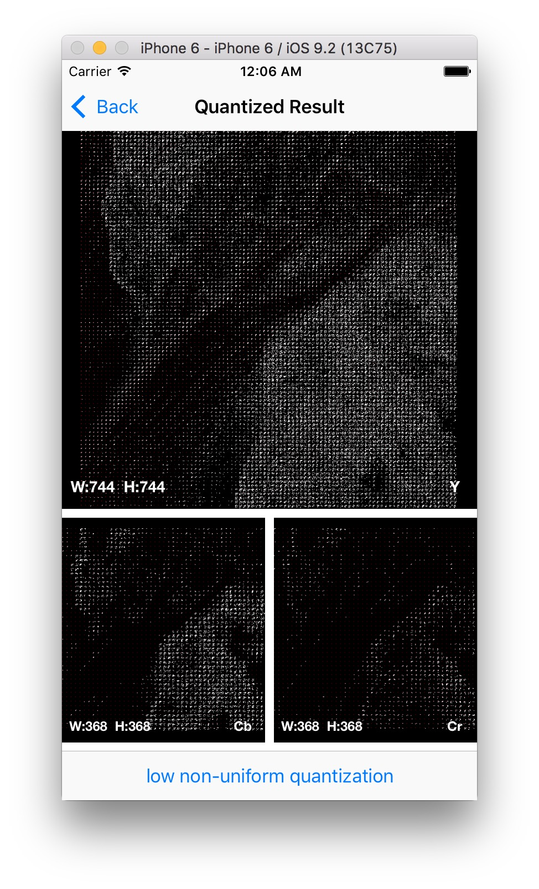
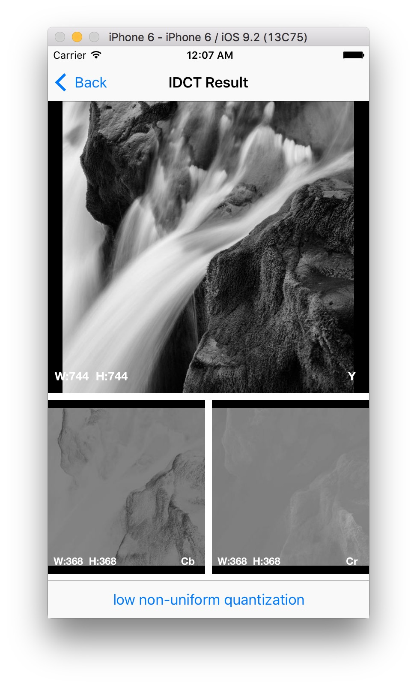
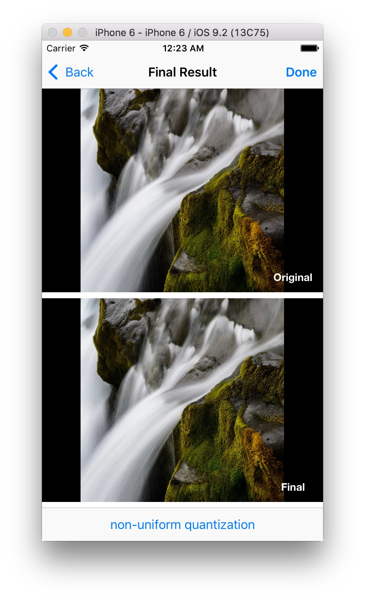

# JPEG Compression
#### Chong Guo armourg@sfu.ca

## Overview

In this assignment, I implemented four kinds of chroma subsampling, DCT and six kinds of quantization for the encoder and decoder of JPEG, to make it user friendly, I made an iOS app using Objective-C/Objective-C++/C++ that can run in both iPhone and iPad platform.

## Features

- **Image Source** 
    - You can import the source image by two ways: **photo album** or **take a photo**

- **RGB to YCbCr**
    - Used OpenCV `split` function to split the image into three channel, and then for each channel follow the `RGB to YCbCr` conversion matrix. 
     
- **Subsampling**
    - Support 4 kinds of chroma subsampling
        - 4:4:4
            - the easiest, there is no reduce of image size
        - 4:2:2
            - the width becomes $\frac{1}{2}$ of original image
        - 4:2:0
            - the most common one, both width and height become $\frac{1}{2}$ of original one
        - 4:1:1
            - the width becomes $\frac{1}{4}$ of original image     
    - Make sure before the subsampling, clip the original image size into multiple of 8

- **DCT**
    - Just simply do matrix multiplication follow the formula $M_{dest} = M_{DCT} * M_{src} * M_{DCT}^T$ 
    - Always use `float` but not `int` type to prevent precision losing

- **Quantization**
    - Do matrix per-element division and use `roundf` to get the nearest `int` as the quantization result 
    - Support 6 kinds of quantization matrix and can easily switch between them in iOS app to see their different effect.

- **Inverse Quantization + Inverse DCT**
    - For inverse quantization, just change the division to multiplication
    - For inverse DCT, change the matrix multiplication formula to $M_{dest} = M_{DCT}^T * M_{src} * M_{DCT}$ 

- **Back to RGB**
    - First inverse the subsampling procedure according to the subsampling used before
    - Then follow the `YCbCr to RGB` conversion matrix to transform it into RGB channels
    - Used OpenCV `merge` function to merge three one-channel images into RGB three channel image. 

## Problems & Solving

#####  1. RGB `uchar` overflow problem

- When I try to get the final RGB image from YCbCr channels, I encountered this problem, which is because `uchar` can only contain 0~255, but something smaller or larger then this range will happen when apply the conversion matrix to YCbCr.

- Solved by check the RGB value first before storing them into `cv::Mat`.
 
##### 2. White dots problem

- Sometimes I'll get many undesired white dots in the final RGB image.

- Solved by make sure all the data type of my `cv::Mat` in every function matched the type that they need to have, do some type conversion if need.

## Others

- Used OpenCV to handle matrix computation

- Used Github to do the version control 

- Followed Google Objective-C / Objective-C++ Style

- Self-designed the iOS interface, work for both iPhone and iPad

- Coded 3000+ lines of code within four days

## App screen shots

